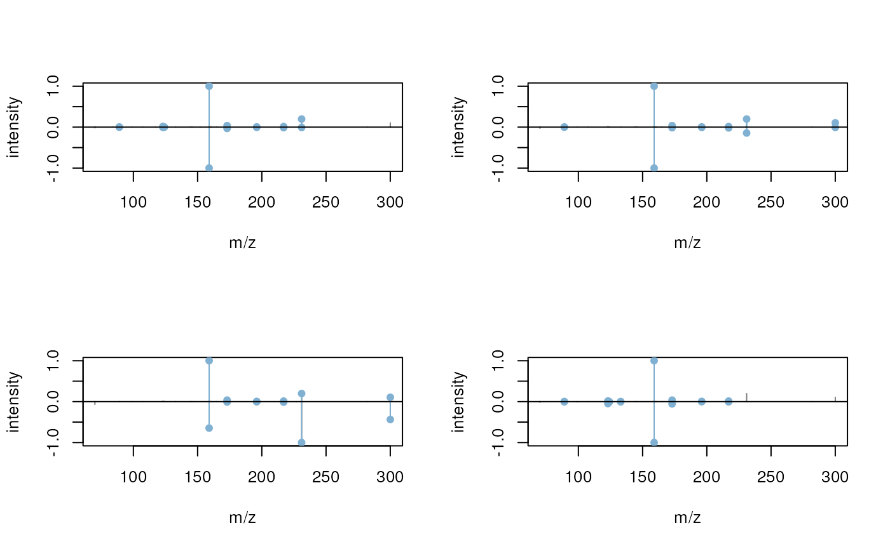
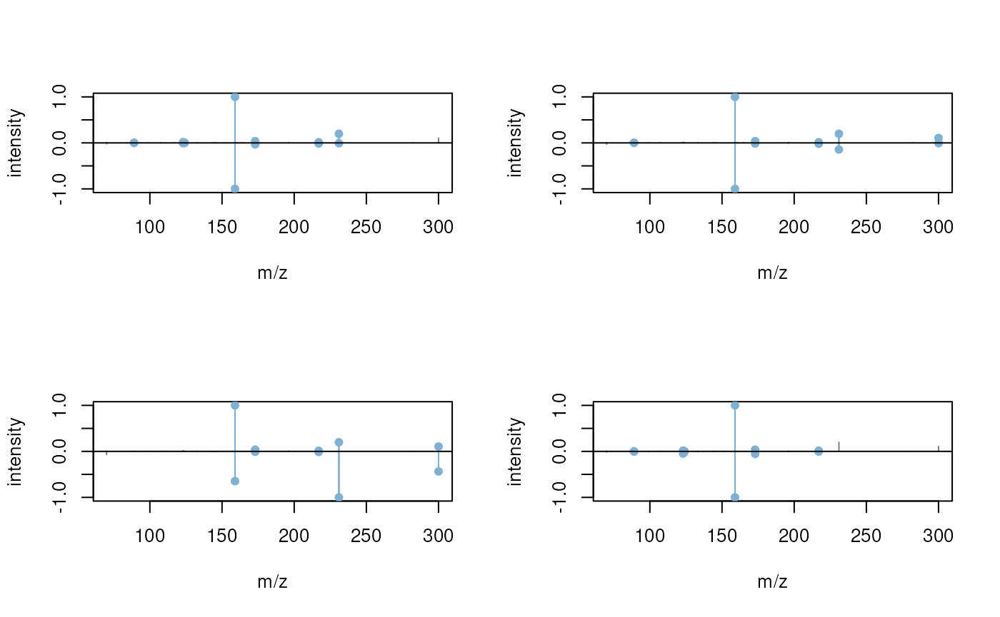

# Annotation of MS-based Metabolomics Data

**Package**:
*[MetaboAnnotation](https://bioconductor.org/packages/3.23/MetaboAnnotation)*\
**Authors**: Michael Witting \[aut\] (ORCID:
<https://orcid.org/0000-0002-1462-4426>), Johannes Rainer \[aut, cre\]
(ORCID: <https://orcid.org/0000-0002-6977-7147>), Andrea Vicini \[aut\]
(ORCID: <https://orcid.org/0000-0001-9438-6909>), Carolin Huber \[aut\]
(ORCID: <https://orcid.org/0000-0002-9355-8948>), Philippine Louail
\[aut\] (ORCID: <https://orcid.org/0009-0007-5429-6846>), Nir Shachaf
\[ctb\]\
**Compiled**: Mon Mar 2 07:03:50 2026

## Introduction

The
*[MetaboAnnotation](https://bioconductor.org/packages/3.23/MetaboAnnotation)*
package defines high-level user functionality to support and facilitate
annotation of MS-based metabolomics data (Rainer et al. 2022).

## Installation

The package can be installed with the *BiocManager* package. To install
`BiocManager` use `install.packages("BiocManager")` and, after that,
`BiocManager::install("MetaboAnnotation")` to install this package.

## General description

*MetaboAnnotation* provides a set of *matching* functions that allow
comparison (and matching) between *query* and *target* entities. These
entities can be chemical formulas, numeric values (e.g. m/z or retention
times) or fragment spectra. The available matching functions are:

- [`matchFormula()`](https://rformassspectrometry.github.io/MetaboAnnotation/reference/matchFormula.md):
  to match chemical formulas.
- [`matchSpectra()`](https://rformassspectrometry.github.io/MetaboAnnotation/reference/matchSpectra.md):
  to match fragment spectra.
- [`matchValues()`](https://rformassspectrometry.github.io/MetaboAnnotation/reference/matchValues.md)
  (formerly
  [`matchMz()`](https://rformassspectrometry.github.io/MetaboAnnotation/reference/matchValues.md)):
  to match numerical values (m/z, masses, retention times etc).

For each of these matching functions *parameter* objects are available
that allow different types or matching algorithms. Refer to the help
pages for a detailed listing of these
(e.g. [`?matchFormula`](https://rformassspectrometry.github.io/MetaboAnnotation/reference/matchFormula.md),
[`?matchSpectra`](https://rformassspectrometry.github.io/MetaboAnnotation/reference/matchSpectra.md)
or
[`?matchValues`](https://rformassspectrometry.github.io/MetaboAnnotation/reference/matchValues.md)).
As a result, a `Matched` (or `MatchedSpectra`) object is returned which
streamlines and simplifies handling of the potential one-to-many (or
one-to-none) matching.

## Example use cases

The following sections illustrate example use cases of the functionality
provided by the *MetaboAnnotation* package.

``` r

library(MetaboAnnotation)
```

### Matching of m/z values

In this section a simple matching of feature m/z values against
theoretical m/z values is performed. This is the lowest level of
confidence in metabolite annotation. However, it gives ideas about
potential metabolites that can be analyzed in further downstream
experiments and analyses.

The following example loads the feature table from a lipidomics
experiments and matches the measured m/z values against reference masses
from LipidMaps. Below we use a `data.frame` as *reference* database, but
a `CompDb` compound database instance (as created by the
*[CompoundDb](https://bioconductor.org/packages/3.23/CompoundDb)*
package) would also be supported.

``` r

ms1_features <- read.table(system.file("extdata", "MS1_example.txt",
                                       package = "MetaboAnnotation"),
                           header = TRUE, sep = "\t")
head(ms1_features)
```

    ##     feature_id       mz    rtime
    ## 1 Cluster_0001 102.1281 1.560147
    ## 2 Cluster_0002 102.1279 2.153590
    ## 3 Cluster_0003 102.1281 2.925570
    ## 4 Cluster_0004 102.1281 3.419617
    ## 5 Cluster_0005 102.1270 5.801039
    ## 6 Cluster_0006 102.1230 8.137535

``` r

target_df <- read.table(system.file("extdata", "LipidMaps_CompDB.txt",
                                    package = "MetaboAnnotation"),
                        header = TRUE, sep = "\t")
head(target_df)
```

    ##   headgroup        name exactmass    formula chain_type
    ## 1       NAE  NAE 20:4;O  363.2773  C22H37NO3       even
    ## 2       NAT  NAT 20:4;O  427.2392 C22H37NO5S       even
    ## 3       NAE NAE 20:3;O2  381.2879  C22H39NO4       even
    ## 4       NAE    NAE 20:4  347.2824  C22H37NO2       even
    ## 5       NAE    NAE 18:2  323.2824  C20H37NO2       even
    ## 6       NAE    NAE 18:3  321.2668  C20H35NO2       even

For reference (target) compounds we have only the mass available. We
need to convert this mass to m/z values in order to match the m/z values
from the features (i.e. the query m/z values) against them. For this we
need to define the *most likely* ions/adducts that would be generated
from the compounds based on the ionization used in the experiment. We
assume the most abundant adducts from the compounds being `"[M+H]+"` and
`"[M+Na]+`. We next perform the matching with the
[`matchValues()`](https://rformassspectrometry.github.io/MetaboAnnotation/reference/matchValues.md)
function providing the query and target data as well as a parameter
object (in our case a `Mass2MzParam`) with the settings for the
matching. With the `Mass2MzParam`, the mass or target compounds get
first converted to m/z values, based on the defined adducts, and these
are then matched against the query m/z values (i.e. the m/z values for
the features). To get a full list of supported adducts the
`MetaboCoreUtils::adductNames(polarity = "positive")` or
`MetaboCoreUtils::adductNames(polarity = "negative")` can be used). Note
also, to keep the runtime of this vignette short, we match only the
first 100 features.

``` r

parm <- Mass2MzParam(adducts = c("[M+H]+", "[M+Na]+"),
                           tolerance = 0.005, ppm = 0)

matched_features <- matchValues(ms1_features[1:100, ], target_df, parm)
matched_features
```

    ## Object of class Matched 
    ## Total number of matches: 55 
    ## Number of query objects: 100 (55 matched)
    ## Number of target objects: 57599 (1 matched)

From the tested 100 features 55 were matched against at least one target
compound (all matches are against a single compound). The result object
(of type `Matched`) contains the full query data frame and target data
frames as well as the matching information. We can access the original
query data with `query()` and the original target data with
[`target()`](https://rformassspectrometry.github.io/MetaboAnnotation/reference/Matched.md)
function:

``` r

head(query(matched_features))
```

    ##     feature_id       mz    rtime
    ## 1 Cluster_0001 102.1281 1.560147
    ## 2 Cluster_0002 102.1279 2.153590
    ## 3 Cluster_0003 102.1281 2.925570
    ## 4 Cluster_0004 102.1281 3.419617
    ## 5 Cluster_0005 102.1270 5.801039
    ## 6 Cluster_0006 102.1230 8.137535

``` r

head(target(matched_features))
```

    ##   headgroup        name exactmass    formula chain_type
    ## 1       NAE  NAE 20:4;O  363.2773  C22H37NO3       even
    ## 2       NAT  NAT 20:4;O  427.2392 C22H37NO5S       even
    ## 3       NAE NAE 20:3;O2  381.2879  C22H39NO4       even
    ## 4       NAE    NAE 20:4  347.2824  C22H37NO2       even
    ## 5       NAE    NAE 18:2  323.2824  C20H37NO2       even
    ## 6       NAE    NAE 18:3  321.2668  C20H35NO2       even

Functions
[`whichQuery()`](https://rformassspectrometry.github.io/MetaboAnnotation/reference/Matched.md)
and
[`whichTarget()`](https://rformassspectrometry.github.io/MetaboAnnotation/reference/Matched.md)
can be used to identify the rows in the query and target data that could
be matched:

``` r

whichQuery(matched_features)
```

    ##  [1]  46  47  48  49  50  51  52  53  54  55  56  57  58  59  60  61  62  63  64
    ## [20]  65  66  67  68  69  70  71  72  73  74  75  76  77  78  79  80  81  82  83
    ## [39]  84  85  86  87  88  89  90  91  92  93  94  95  96  97  98  99 100

``` r

whichTarget(matched_features)
```

    ## [1] 3149

The `colnames` function can be used to evaluate which variables/columns
are available in the `Matched` object.

``` r

colnames(matched_features)
```

    ##  [1] "feature_id"        "mz"                "rtime"            
    ##  [4] "target_headgroup"  "target_name"       "target_exactmass" 
    ##  [7] "target_formula"    "target_chain_type" "adduct"           
    ## [10] "score"             "ppm_error"

These are all columns from the `query`, all columns from the `target`
(the prefix `"target_"` is added to the original column names in
`target`) and information on the matching result (in this case columns
`"adduct"`, `"score"` and `"ppm_error"`).

We can extract the full matching table with
[`matchedData()`](https://rformassspectrometry.github.io/MetaboAnnotation/reference/Matched.md).
This returns a `DataFrame` with all rows in *query* the corresponding
matches in *target* along with the matching adduct (column `"adduct"`)
and the difference in m/z (column `"score"` for absolute differences and
`"ppm_error"` for the m/z relative differences). Note that if a row in
*query* matches multiple elements in *target*, this row will be
duplicated in the `DataFrame` returned by
[`matchedData()`](https://rformassspectrometry.github.io/MetaboAnnotation/reference/Matched.md).
For rows that can not be matched `NA` values are reported.

``` r

matchedData(matched_features)
```

    ## DataFrame with 100 rows and 11 columns
    ##        feature_id        mz     rtime target_headgroup target_name
    ##       <character> <numeric> <numeric>      <character> <character>
    ## 1   Cluster_00...   102.128   1.56015               NA          NA
    ## 2   Cluster_00...   102.128   2.15359               NA          NA
    ## 3   Cluster_00...   102.128   2.92557               NA          NA
    ## 4   Cluster_00...   102.128   3.41962               NA          NA
    ## 5   Cluster_00...   102.127   5.80104               NA          NA
    ## ...           ...       ...       ...              ...         ...
    ## 96  Cluster_00...   201.113   11.2722               FA  FA 10:2;O2
    ## 97  Cluster_00...   201.113   11.4081               FA  FA 10:2;O2
    ## 98  Cluster_00...   201.113   11.4760               FA  FA 10:2;O2
    ## 99  Cluster_00...   201.114   11.5652               FA  FA 10:2;O2
    ## 100 Cluster_01...   201.114   11.7752               FA  FA 10:2;O2
    ##     target_exactmass target_formula target_chain_type      adduct     score
    ##            <numeric>    <character>       <character> <character> <numeric>
    ## 1                 NA             NA                NA          NA        NA
    ## 2                 NA             NA                NA          NA        NA
    ## 3                 NA             NA                NA          NA        NA
    ## 4                 NA             NA                NA          NA        NA
    ## 5                 NA             NA                NA          NA        NA
    ## ...              ...            ...               ...         ...       ...
    ## 96           200.105       C10H16O4              even      [M+H]+ 0.0007312
    ## 97           200.105       C10H16O4              even      [M+H]+ 0.0005444
    ## 98           200.105       C10H16O4              even      [M+H]+ 0.0005328
    ## 99           200.105       C10H16O4              even      [M+H]+ 0.0014619
    ## 100          200.105       C10H16O4              even      [M+H]+ 0.0020342
    ##     ppm_error
    ##     <numeric>
    ## 1          NA
    ## 2          NA
    ## 3          NA
    ## 4          NA
    ## 5          NA
    ## ...       ...
    ## 96    3.63578
    ## 97    2.70695
    ## 98    2.64927
    ## 99    7.26908
    ## 100  10.11476

Individual columns can be simply extracted with the `$` operator:

``` r

matched_features$target_name
```

    ##   [1] NA           NA           NA           NA           NA          
    ##   [6] NA           NA           NA           NA           NA          
    ##  [11] NA           NA           NA           NA           NA          
    ##  [16] NA           NA           NA           NA           NA          
    ##  [21] NA           NA           NA           NA           NA          
    ##  [26] NA           NA           NA           NA           NA          
    ##  [31] NA           NA           NA           NA           NA          
    ##  [36] NA           NA           NA           NA           NA          
    ##  [41] NA           NA           NA           NA           NA          
    ##  [46] "FA 10:2;O2" "FA 10:2;O2" "FA 10:2;O2" "FA 10:2;O2" "FA 10:2;O2"
    ##  [51] "FA 10:2;O2" "FA 10:2;O2" "FA 10:2;O2" "FA 10:2;O2" "FA 10:2;O2"
    ##  [56] "FA 10:2;O2" "FA 10:2;O2" "FA 10:2;O2" "FA 10:2;O2" "FA 10:2;O2"
    ##  [61] "FA 10:2;O2" "FA 10:2;O2" "FA 10:2;O2" "FA 10:2;O2" "FA 10:2;O2"
    ##  [66] "FA 10:2;O2" "FA 10:2;O2" "FA 10:2;O2" "FA 10:2;O2" "FA 10:2;O2"
    ##  [71] "FA 10:2;O2" "FA 10:2;O2" "FA 10:2;O2" "FA 10:2;O2" "FA 10:2;O2"
    ##  [76] "FA 10:2;O2" "FA 10:2;O2" "FA 10:2;O2" "FA 10:2;O2" "FA 10:2;O2"
    ##  [81] "FA 10:2;O2" "FA 10:2;O2" "FA 10:2;O2" "FA 10:2;O2" "FA 10:2;O2"
    ##  [86] "FA 10:2;O2" "FA 10:2;O2" "FA 10:2;O2" "FA 10:2;O2" "FA 10:2;O2"
    ##  [91] "FA 10:2;O2" "FA 10:2;O2" "FA 10:2;O2" "FA 10:2;O2" "FA 10:2;O2"
    ##  [96] "FA 10:2;O2" "FA 10:2;O2" "FA 10:2;O2" "FA 10:2;O2" "FA 10:2;O2"

`NA` is reported for query entries for which no match was found. See
also the help page for
[`?Matched`](https://rformassspectrometry.github.io/MetaboAnnotation/reference/Matched.md)
for more details and information. In addition to the matching of query
m/z against target exact masses as described above it would also be
possible to match directly query m/z against target m/z values by using
the `MzParam` instead of the `Mass2MzParam`.

### Matching of m/z and retention time values

If expected retention time values were available for the target
compounds, an annotation with higher confidence could be performed with
[`matchValues()`](https://rformassspectrometry.github.io/MetaboAnnotation/reference/matchValues.md)
and a `Mass2MzRtParam` parameter object. To illustrate this we randomly
assign retention times from query features to the target compounds
adding also 2 seconds difference. In a real use case the target
`data.frame` would contain masses (or m/z values) for standards along
with the retention times when ions of these standards were measured on
the same LC-MS setup from which the query data derives.

Below we subset our data table with the MS1 features to the first 100
rows (to keep the runtime of the vignette short).

``` r

ms1_subset <- ms1_features[1:100, ]
head(ms1_subset)
```

    ##     feature_id       mz    rtime
    ## 1 Cluster_0001 102.1281 1.560147
    ## 2 Cluster_0002 102.1279 2.153590
    ## 3 Cluster_0003 102.1281 2.925570
    ## 4 Cluster_0004 102.1281 3.419617
    ## 5 Cluster_0005 102.1270 5.801039
    ## 6 Cluster_0006 102.1230 8.137535

The table contains thus retention times of the features in a column
named `"rtime"`.

Next we randomly assign retention times of the features to compounds in
our target data adding a deviation of 2 seconds. As described above, in
a real use case retention times are supposed to be determined by
measuring the compounds with the same LC-MS setup.

``` r

set.seed(123)
target_df$rtime <- sample(ms1_subset$rtime,
                          nrow(target_df), replace = TRUE) + 2
```

We have now retention times available for both the query and the target
data and can thus perform a matching based on m/z **and** retention
times. We use the `Mass2MzRtParam` which allows us to specify (as for
the `Mass2MzParam`) the expected adducts, the maximal acceptable m/z
relative and absolute deviation as well as the maximal acceptable
(absolute) difference in retention times. We use the settings from the
previous section and allow a difference of 10 seconds in retention
times. The retention times are provided in columns named `"rtime"` which
is different from the default (`"rt"`). We thus specify the name of the
column containing the retention times with parameter `rtColname`.

``` r

parm <- Mass2MzRtParam(adducts = c("[M+H]+", "[M+Na]+"),
                       tolerance = 0.005, ppm = 0,
                       toleranceRt = 10)
matched_features <- matchValues(ms1_subset, target_df, param = parm,
                                rtColname = "rtime")
matched_features
```

    ## Object of class Matched 
    ## Total number of matches: 31 
    ## Number of query objects: 100 (31 matched)
    ## Number of target objects: 57599 (1 matched)

Less features were matched based on m/z and retention times.

``` r

matchedData(matched_features)[whichQuery(matched_features), ]
```

    ## DataFrame with 31 rows and 13 columns
    ##        feature_id        mz     rtime target_headgroup target_name
    ##       <character> <numeric> <numeric>      <character> <character>
    ## 1   Cluster_00...   201.113   5.87206               FA  FA 10:2;O2
    ## 2   Cluster_00...   201.113   5.93346               FA  FA 10:2;O2
    ## 3   Cluster_00...   201.113   6.03653               FA  FA 10:2;O2
    ## 4   Cluster_00...   201.114   6.16709               FA  FA 10:2;O2
    ## 5   Cluster_00...   201.113   6.31781               FA  FA 10:2;O2
    ## ...           ...       ...       ...              ...         ...
    ## 27  Cluster_00...   201.113   11.2722               FA  FA 10:2;O2
    ## 28  Cluster_00...   201.113   11.4081               FA  FA 10:2;O2
    ## 29  Cluster_00...   201.113   11.4760               FA  FA 10:2;O2
    ## 30  Cluster_00...   201.114   11.5652               FA  FA 10:2;O2
    ## 31  Cluster_01...   201.114   11.7752               FA  FA 10:2;O2
    ##     target_exactmass target_formula target_chain_type target_rtime      adduct
    ##            <numeric>    <character>       <character>    <numeric> <character>
    ## 1            200.105       C10H16O4              even      15.8624      [M+H]+
    ## 2            200.105       C10H16O4              even      15.8624      [M+H]+
    ## 3            200.105       C10H16O4              even      15.8624      [M+H]+
    ## 4            200.105       C10H16O4              even      15.8624      [M+H]+
    ## 5            200.105       C10H16O4              even      15.8624      [M+H]+
    ## ...              ...            ...               ...          ...         ...
    ## 27           200.105       C10H16O4              even      15.8624      [M+H]+
    ## 28           200.105       C10H16O4              even      15.8624      [M+H]+
    ## 29           200.105       C10H16O4              even      15.8624      [M+H]+
    ## 30           200.105       C10H16O4              even      15.8624      [M+H]+
    ## 31           200.105       C10H16O4              even      15.8624      [M+H]+
    ##         score ppm_error  score_rt
    ##     <numeric> <numeric> <numeric>
    ## 1   0.0004538   2.25645  -9.99030
    ## 2   0.0004407   2.19131  -9.92890
    ## 3   0.0005655   2.81186  -9.82583
    ## 4   0.0015560   7.73698  -9.69527
    ## 5   0.0006845   3.40357  -9.54455
    ## ...       ...       ...       ...
    ## 27  0.0007312   3.63578  -4.59014
    ## 28  0.0005444   2.70695  -4.45431
    ## 29  0.0005328   2.64927  -4.38634
    ## 30  0.0014619   7.26908  -4.29719
    ## 31  0.0020342  10.11476  -4.08719

### Matching of `SummarizedExperiment` or `QFeatures` objects

Results from LC-MS preprocessing (e.g. by the
*[xcms](https://bioconductor.org/packages/3.23/xcms)* package) or
generally metabolomics results might be best represented and bundled as
`SummarizedExperiment` or `QFeatures` objects (from the same-named
Bioconductor packages). A `XCMSnExp` preprocessing result from `xcms`
can for example be converted to a `SummarizedExperiment` using the
`quantify()` method from the `xcms` package. The feature definitions
(i.e. their m/z and retention time values) will then be stored in the
object’s
[`rowData()`](https://rdrr.io/pkg/SummarizedExperiment/man/SummarizedExperiment-class.html)
while the assay (the numerical matrix) will contain the feature
abundances across all samples. Such `SummarizedExperiment` objects can
be simply passed as `query` objects to the
[`matchValues()`](https://rformassspectrometry.github.io/MetaboAnnotation/reference/matchValues.md)
method. To illustrate this, we create below a simple
`SummarizedExperiment` using the `ms1_features` data frame from the
example above as `rowData` and adding a `matrix` with random values as
assay.

``` r

library(SummarizedExperiment)
```

    ## Loading required package: MatrixGenerics

    ## Loading required package: matrixStats

    ## 
    ## Attaching package: 'MatrixGenerics'

    ## The following objects are masked from 'package:matrixStats':
    ## 
    ##     colAlls, colAnyNAs, colAnys, colAvgsPerRowSet, colCollapse,
    ##     colCounts, colCummaxs, colCummins, colCumprods, colCumsums,
    ##     colDiffs, colIQRDiffs, colIQRs, colLogSumExps, colMadDiffs,
    ##     colMads, colMaxs, colMeans2, colMedians, colMins, colOrderStats,
    ##     colProds, colQuantiles, colRanges, colRanks, colSdDiffs, colSds,
    ##     colSums2, colTabulates, colVarDiffs, colVars, colWeightedMads,
    ##     colWeightedMeans, colWeightedMedians, colWeightedSds,
    ##     colWeightedVars, rowAlls, rowAnyNAs, rowAnys, rowAvgsPerColSet,
    ##     rowCollapse, rowCounts, rowCummaxs, rowCummins, rowCumprods,
    ##     rowCumsums, rowDiffs, rowIQRDiffs, rowIQRs, rowLogSumExps,
    ##     rowMadDiffs, rowMads, rowMaxs, rowMeans2, rowMedians, rowMins,
    ##     rowOrderStats, rowProds, rowQuantiles, rowRanges, rowRanks,
    ##     rowSdDiffs, rowSds, rowSums2, rowTabulates, rowVarDiffs, rowVars,
    ##     rowWeightedMads, rowWeightedMeans, rowWeightedMedians,
    ##     rowWeightedSds, rowWeightedVars

    ## Loading required package: GenomicRanges

    ## Loading required package: IRanges

    ## Loading required package: Seqinfo

    ## Loading required package: Biobase

    ## Welcome to Bioconductor
    ## 
    ##     Vignettes contain introductory material; view with
    ##     'browseVignettes()'. To cite Bioconductor, see
    ##     'citation("Biobase")', and for packages 'citation("pkgname")'.

    ## 
    ## Attaching package: 'Biobase'

    ## The following object is masked from 'package:MatrixGenerics':
    ## 
    ##     rowMedians

    ## The following objects are masked from 'package:matrixStats':
    ## 
    ##     anyMissing, rowMedians

    ## The following object is masked from 'package:AnnotationHub':
    ## 
    ##     cache

``` r

se <- SummarizedExperiment(
    assays = matrix(rnorm(nrow(ms1_features) * 4), ncol = 4,
                    dimnames = list(NULL, c("A", "B", "C", "D"))),
    rowData = ms1_features)
```

We can now use the same
[`matchValues()`](https://rformassspectrometry.github.io/MetaboAnnotation/reference/matchValues.md)
call as before to perform the matching. Matching will be performed on
the object’s `rowData`, i.e. each row/element of the
`SummarizedExperiment` will be matched against the target using e.g. m/z
values available in columns of the object’s `rowData`:

``` r

parm <- Mass2MzParam(adducts = c("[M+H]+", "[M+Na]+"),
                     tolerance = 0.005, ppm = 0)
matched_features <- matchValues(se, target_df, param = parm)
matched_features
```

    ## Object of class Matched 
    ## Total number of matches: 9173 
    ## Number of query objects: 2842 (1969 matched)
    ## Number of target objects: 57599 (3296 matched)

As `query`, the result contains the full `SummarizedExperiment`, but
[`colnames()`](https://rdrr.io/r/base/colnames.html) and
[`matchedData()`](https://rformassspectrometry.github.io/MetaboAnnotation/reference/Matched.md)
will access the respective information from the `rowData` of this
`SummarizedExperiment`:

``` r

colnames(matched_features)
```

    ##  [1] "feature_id"        "mz"                "rtime"            
    ##  [4] "target_headgroup"  "target_name"       "target_exactmass" 
    ##  [7] "target_formula"    "target_chain_type" "target_rtime"     
    ## [10] "adduct"            "score"             "ppm_error"

``` r

matchedData(matched_features)
```

    ## DataFrame with 10046 rows and 12 columns
    ##          feature_id        mz     rtime target_headgroup   target_name
    ##         <character> <numeric> <numeric>      <character>   <character>
    ## 1     Cluster_00...   102.128   1.56015               NA            NA
    ## 2     Cluster_00...   102.128   2.15359               NA            NA
    ## 3     Cluster_00...   102.128   2.92557               NA            NA
    ## 4     Cluster_00...   102.128   3.41962               NA            NA
    ## 5     Cluster_00...   102.127   5.80104               NA            NA
    ## ...             ...       ...       ...              ...           ...
    ## 10042 Cluster_28...   957.771   20.2705               TG    TG 54:2;O3
    ## 10043 Cluster_28...   960.791   20.8865           HexCer HexCer 52:...
    ## 10044 Cluster_28...   961.361   13.0214               NA            NA
    ## 10045 Cluster_28...   970.873   22.0981             ACer ACer 60:1;...
    ## 10046 Cluster_28...   972.734   15.6914          Hex2Cer Hex2Cer 42...
    ##       target_exactmass target_formula target_chain_type target_rtime
    ##              <numeric>    <character>       <character>    <numeric>
    ## 1                   NA             NA                NA           NA
    ## 2                   NA             NA                NA           NA
    ## 3                   NA             NA                NA           NA
    ## 4                   NA             NA                NA           NA
    ## 5                   NA             NA                NA           NA
    ## ...                ...            ...               ...          ...
    ## 10042          934.784      C57H106O9              even      15.9950
    ## 10043          959.779     C58H105NO9              even      10.5076
    ## 10044               NA             NA                NA           NA
    ## 10045          947.888     C60H117NO6              even       4.2806
    ## 10046          971.727  C54H101NO1...              even      19.7329
    ##            adduct      score ppm_error
    ##       <character>  <numeric> <numeric>
    ## 1              NA         NA        NA
    ## 2              NA         NA        NA
    ## 3              NA         NA        NA
    ## 4              NA         NA        NA
    ## 5              NA         NA        NA
    ## ...           ...        ...       ...
    ## 10042     [M+Na]+ -0.0021897  2.286241
    ## 10043      [M+H]+  0.0045398  4.725089
    ## 10044          NA         NA        NA
    ## 10045     [M+Na]+ -0.0045054  4.640545
    ## 10046      [M+H]+ -0.0004240  0.435885

Subsetting the result object, to e.g. just matched elements will also
subset the `SummarizedExperiment`.

``` r

matched_sub <- matched_features[whichQuery(matched_features)]
MetaboAnnotation::query(matched_sub)
```

    ## class: SummarizedExperiment 
    ## dim: 1969 4 
    ## metadata(0):
    ## assays(1): ''
    ## rownames: NULL
    ## rowData names(3): feature_id mz rtime
    ## colnames(4): A B C D
    ## colData names(0):

A `QFeatures` object is essentially a container for several
`SummarizedExperiment` objects which rows (features) are related with
each other. Such an object could thus for example contain the full
feature data from an LC-MS experiment as one assay and a compounded
feature data in which data from ions of the same compound are aggregated
as an additional assay. Below we create such an object using our
`SummarizedExperiment` as an assay of name `"features"`. For now we
don’t add any additional assay to that `QFeatures`, thus, the object
contains only this single data set.

``` r

library(QFeatures)
```

    ## Loading required package: MultiAssayExperiment

    ## 
    ## Attaching package: 'QFeatures'

    ## The following object is masked from 'package:base':
    ## 
    ##     sweep

``` r

qf <- QFeatures(list(features = se))
qf
```

    ## An instance of class QFeatures (type: bulk) with 1 set:
    ## 
    ##  [1] features: SummarizedExperiment with 2842 rows and 4 columns

[`matchValues()`](https://rformassspectrometry.github.io/MetaboAnnotation/reference/matchValues.md)
supports also matching of `QFeatures` objects but the user needs to
define the assay which should be used for the matching with the
`queryAssay` parameter.

``` r

matched_qf <- matchValues(qf, target_df, param = parm, queryAssay = "features")
matched_qf
```

    ## Object of class Matched 
    ## Total number of matches: 9173 
    ## Number of query objects: 2842 (1969 matched)
    ## Number of target objects: 57599 (3296 matched)

[`colnames()`](https://rdrr.io/r/base/colnames.html) and
[`matchedData()`](https://rformassspectrometry.github.io/MetaboAnnotation/reference/Matched.md)
allow to access the `rowData` of the `SummarizedExperiment` stored in
the `QFeatures`’ `"features"` assay:

``` r

colnames(matched_qf)
```

    ##  [1] "feature_id"        "mz"                "rtime"            
    ##  [4] "target_headgroup"  "target_name"       "target_exactmass" 
    ##  [7] "target_formula"    "target_chain_type" "target_rtime"     
    ## [10] "adduct"            "score"             "ppm_error"

``` r

matchedData(matched_qf)
```

    ## DataFrame with 10046 rows and 12 columns
    ##          feature_id        mz     rtime target_headgroup   target_name
    ##         <character> <numeric> <numeric>      <character>   <character>
    ## 1     Cluster_00...   102.128   1.56015               NA            NA
    ## 2     Cluster_00...   102.128   2.15359               NA            NA
    ## 3     Cluster_00...   102.128   2.92557               NA            NA
    ## 4     Cluster_00...   102.128   3.41962               NA            NA
    ## 5     Cluster_00...   102.127   5.80104               NA            NA
    ## ...             ...       ...       ...              ...           ...
    ## 10042 Cluster_28...   957.771   20.2705               TG    TG 54:2;O3
    ## 10043 Cluster_28...   960.791   20.8865           HexCer HexCer 52:...
    ## 10044 Cluster_28...   961.361   13.0214               NA            NA
    ## 10045 Cluster_28...   970.873   22.0981             ACer ACer 60:1;...
    ## 10046 Cluster_28...   972.734   15.6914          Hex2Cer Hex2Cer 42...
    ##       target_exactmass target_formula target_chain_type target_rtime
    ##              <numeric>    <character>       <character>    <numeric>
    ## 1                   NA             NA                NA           NA
    ## 2                   NA             NA                NA           NA
    ## 3                   NA             NA                NA           NA
    ## 4                   NA             NA                NA           NA
    ## 5                   NA             NA                NA           NA
    ## ...                ...            ...               ...          ...
    ## 10042          934.784      C57H106O9              even      15.9950
    ## 10043          959.779     C58H105NO9              even      10.5076
    ## 10044               NA             NA                NA           NA
    ## 10045          947.888     C60H117NO6              even       4.2806
    ## 10046          971.727  C54H101NO1...              even      19.7329
    ##            adduct      score ppm_error
    ##       <character>  <numeric> <numeric>
    ## 1              NA         NA        NA
    ## 2              NA         NA        NA
    ## 3              NA         NA        NA
    ## 4              NA         NA        NA
    ## 5              NA         NA        NA
    ## ...           ...        ...       ...
    ## 10042     [M+Na]+ -0.0021897  2.286241
    ## 10043      [M+H]+  0.0045398  4.725089
    ## 10044          NA         NA        NA
    ## 10045     [M+Na]+ -0.0045054  4.640545
    ## 10046      [M+H]+ -0.0004240  0.435885

### Matching of MS/MS spectra

In this section we match experimental MS/MS spectra against reference
spectra. This can also be performed with functions from the
*[Spectra](https://bioconductor.org/packages/3.23/Spectra)* package (see
[SpectraTutorials](https://jorainer.github.io/SpectraTutorials/), but
the functions and concepts used here are more suitable to the *end user*
as they simplify the handling of the spectra matching results.

Below we load spectra from a file from a reversed-phase (DDA) LC-MS/MS
run of the Agilent Pesticide mix. With
[`filterMsLevel()`](https://rdrr.io/pkg/ProtGenerics/man/protgenerics.html)
we subset the data set to only MS2 spectra. To reduce processing time of
the example we further subset the `Spectra` to a small set of selected
MS2 spectra. In addition we assign *feature identifiers* to each
spectrum (again, for this example these are arbitrary IDs, but in a
*real* data analysis such identifiers could indicate to which LC-MS
feature these spectra belong).

``` r

library(Spectra)
## Load an example data set from *MetaboAnnotation*
library(MsDataHub)
fl <- MsDataHub::PestMix1_DDA.mzML()
pest_ms2 <- filterMsLevel(Spectra(fl), 2L)
## subset to selected spectra.
pest_ms2 <- pest_ms2[c(808, 809, 945:955)]
## assign arbitrary *feature IDs* to each spectrum.
pest_ms2$feature_id <- c("FT001", "FT001", "FT002", "FT003", "FT003", "FT003",
                         "FT004", "FT004", "FT004", "FT005", "FT005", "FT006",
                         "FT006")
## assign also *spectra IDs* to each
pest_ms2$spectrum_id <- paste0("sp_", seq_along(pest_ms2))
pest_ms2
```

    ## MSn data (Spectra) with 13 spectra in a MsBackendMzR backend:
    ##       msLevel     rtime scanIndex
    ##     <integer> <numeric> <integer>
    ## 1           2   361.651      2853
    ## 2           2   361.741      2854
    ## 3           2   377.609      3030
    ## 4           2   377.699      3031
    ## 5           2   378.120      3033
    ## ...       ...       ...       ...
    ## 9           2   378.959      3039
    ## 10          2   379.379      3041
    ## 11          2   380.059      3045
    ## 12          2   380.609      3048
    ## 13          2   381.029      3050
    ##  ... 36 more variables/columns.
    ## 
    ## file(s):
    ## 1a194bebc476_7861
    ## Processing:
    ##  Filter: select MS level(s) 2 [Mon Mar  2 07:04:14 2026]

This `Spectra` should now represent MS2 spectra associated with LC-MS
features from an untargeted LC-MS/MS experiment that we would like to
annotate by matching them against a spectral reference library.

We thus load below a `Spectra` object that represents MS2 data from a
very small subset of [MassBank](https://massbank.eu/MassBank/) release
*2021.03*. This small `Spectra` object is provided within this package
but it would be possible to use any other `Spectra` object with
reference fragment spectra instead (see also the
[SpectraTutorials](https://jorainer.github.io/SpectraTutorials/)
workshop). As an alternative, it would also be possible to use a
`CompDb` object representing a compound annotation database (defined in
the *[CompoundDb](https://bioconductor.org/packages/3.23/CompoundDb)*
package) with parameter `target`. See the
[`matchSpectra()`](https://rformassspectrometry.github.io/MetaboAnnotation/reference/matchSpectra.md)
help page or section *Query against multiple reference databases* below
for more details and options to retrieve such annotation resources from
Bioconductor’s
*[AnnotationHub](https://bioconductor.org/packages/3.23/AnnotationHub)*.

``` r

load(system.file("extdata", "minimb.RData", package = "MetaboAnnotation"))
minimb
```

    ## MSn data (Spectra) with 100 spectra in a MsBackendDataFrame backend:
    ##       msLevel     rtime scanIndex
    ##     <integer> <numeric> <integer>
    ## 1           2        NA        NA
    ## 2           2        NA        NA
    ## 3           2        NA        NA
    ## 4           2        NA        NA
    ## 5           2        NA        NA
    ## ...       ...       ...       ...
    ## 96         NA        NA        NA
    ## 97          2        NA        NA
    ## 98          2        NA        NA
    ## 99          2        NA        NA
    ## 100         2        NA        NA
    ##  ... 42 more variables/columns.
    ## Processing:
    ##  Filter: select spectra with polarity 1 [Wed Mar 31 10:06:28 2021]
    ##  Switch backend from MsBackendMassbankSql to MsBackendDataFrame [Wed Mar 31 10:07:59 2021]

We can now use the
[`matchSpectra()`](https://rformassspectrometry.github.io/MetaboAnnotation/reference/matchSpectra.md)
function to match each of our experimental *query* spectra against the
*target* (reference) spectra. Settings for this matching can be defined
with a dedicated *param* object. We use below the `CompareSpectraParam`
that uses the
[`compareSpectra()`](https://rdrr.io/pkg/ProtGenerics/man/protgenerics.html)
function from the `Spectra` package to calculate similarities between
each query spectrum and all target spectra. `CompareSpectraParam` allows
to set all individual settings for the
[`compareSpectra()`](https://rdrr.io/pkg/ProtGenerics/man/protgenerics.html)
call with parameters `MAPFUN`, `ppm`, `tolerance` and `FUN` (see the
help on
[`compareSpectra()`](https://rdrr.io/pkg/ProtGenerics/man/protgenerics.html)
in the *[Spectra](https://bioconductor.org/packages/3.23/Spectra)*
package for more details). In addition, we can *pre-filter* the target
spectra for each individual query spectrum to speed-up the calculations.
By setting `requirePrecursor = TRUE` we compare below each query
spectrum only to target spectra with matching precursor m/z (accepting a
deviation defined by parameters `ppm` and `tolerance`). By default,
[`matchSpectra()`](https://rformassspectrometry.github.io/MetaboAnnotation/reference/matchSpectra.md)
with `CompareSpectraParam` considers spectra with a similarity score
higher than 0.7 as *matching* and these are thus reported. As an
additional configuration we set `matchedPeaksCount = TRUE` to report the
number of matching peaks between the compared (and matched) spectra.

``` r

csp <- CompareSpectraParam(requirePrecursor = TRUE, ppm = 10,
                           matchedPeaksCount = TRUE)
mtches <- matchSpectra(pest_ms2, minimb, param = csp)
mtches
```

    ## Object of class MatchedSpectra 
    ## Total number of matches: 16 
    ## Number of query objects: 13 (5 matched)
    ## Number of target objects: 100 (11 matched)

The results are reported as a `MatchedSpectra` object which represents
the matching results for all query spectra. This type of object contains
all query spectra, all target spectra, the matching information and the
parameter object with the settings of the matching. The object can be
subset to results of selected **query** spectra using the `[` method.
The length of the result object matches thus the number of query
spectra:

``` r

length(pest_ms2)
```

    ## [1] 13

``` r

length(mtches)
```

    ## [1] 13

To subset to the results for the first query spectrum:

``` r

mtches[1]
```

    ## Object of class MatchedSpectra 
    ## Total number of matches: 0 
    ## Number of query objects: 1 (0 matched)
    ## Number of target objects: 100 (0 matched)

In this case, for the first query spectrum, no match was found among the
target spectra. Below we subset the `MatchedSpectra` to results for the
second query spectrum:

``` r

mtches[2]
```

    ## Object of class MatchedSpectra 
    ## Total number of matches: 4 
    ## Number of query objects: 1 (1 matched)
    ## Number of target objects: 100 (4 matched)

The second query spectrum could be matched to 4 target spectra. The
matching between query and target spectra can be n:m, i.e. each query
spectrum can match no or multiple target spectra and each target
spectrum can be matched to none, one or multiple query spectra.

Data (spectra variables of either the query and/or the target spectra)
can be extracted from the result object with the
[`spectraData()`](https://rdrr.io/pkg/ProtGenerics/man/protgenerics.html)
function or with `$` (similar to a `Spectra` object). The
`spectraVariables` function can be used to list all available spectra
variables in the result object:

``` r

spectraVariables(mtches)
```

    ##  [1] "msLevel"                        "rtime"                         
    ##  [3] "acquisitionNum"                 "scanIndex"                     
    ##  [5] "dataStorage"                    "dataOrigin"                    
    ##  [7] "centroided"                     "smoothed"                      
    ##  [9] "polarity"                       "precScanNum"                   
    ## [11] "precursorMz"                    "precursorIntensity"            
    ## [13] "precursorCharge"                "collisionEnergy"               
    ## [15] "isolationWindowLowerMz"         "isolationWindowTargetMz"       
    ## [17] "isolationWindowUpperMz"         "peaksCount"                    
    ## [19] "totIonCurrent"                  "basePeakMZ"                    
    ## [21] "basePeakIntensity"              "electronBeamEnergy"            
    ## [23] "ionisationEnergy"               "lowMZ"                         
    ## [25] "highMZ"                         "mergedScan"                    
    ## [27] "mergedResultScanNum"            "mergedResultStartScanNum"      
    ## [29] "mergedResultEndScanNum"         "injectionTime"                 
    ## [31] "filterString"                   "spectrumId"                    
    ## [33] "ionMobilityDriftTime"           "scanWindowLowerLimit"          
    ## [35] "scanWindowUpperLimit"           "feature_id"                    
    ## [37] "spectrum_id"                    ".original_query_index"         
    ## [39] "target_msLevel"                 "target_rtime"                  
    ## [41] "target_acquisitionNum"          "target_scanIndex"              
    ## [43] "target_dataStorage"             "target_dataOrigin"             
    ## [45] "target_centroided"              "target_smoothed"               
    ## [47] "target_polarity"                "target_precScanNum"            
    ## [49] "target_precursorMz"             "target_precursorIntensity"     
    ## [51] "target_precursorCharge"         "target_collisionEnergy"        
    ## [53] "target_isolationWindowLowerMz"  "target_isolationWindowTargetMz"
    ## [55] "target_isolationWindowUpperMz"  "target_spectrum_id"            
    ## [57] "target_spectrum_name"           "target_date"                   
    ## [59] "target_authors"                 "target_license"                
    ## [61] "target_copyright"               "target_publication"            
    ## [63] "target_splash"                  "target_compound_id"            
    ## [65] "target_adduct"                  "target_ionization"             
    ## [67] "target_ionization_voltage"      "target_fragmentation_mode"     
    ## [69] "target_collision_energy_text"   "target_instrument"             
    ## [71] "target_instrument_type"         "target_formula"                
    ## [73] "target_exactmass"               "target_smiles"                 
    ## [75] "target_inchi"                   "target_inchikey"               
    ## [77] "target_cas"                     "target_pubchem"                
    ## [79] "target_synonym"                 "target_precursor_mz_text"      
    ## [81] "target_compound_name"           "score"                         
    ## [83] "matched_peaks_count"

This lists the spectra variables from both the *query* **and** the
*target* spectra, with the prefix `"target_"` being used for spectra
variable names of the target spectra. Spectra variable `"score"`
contains the similarity score. If `matchedPeaksCount = TRUE` was used, a
column `"matched_peaks_count"` is available that lists the number of
matching peaks between the compared spectra.

Note that by default also an additional column `".original_query_index"`
is added to the `query` `Spectra` object by the
[`matchSpectra()`](https://rformassspectrometry.github.io/MetaboAnnotation/reference/matchSpectra.md)
function, that enables an easier mapping of results to the *original*
query object used as input, in particular, if the `MatchedSpectra`
object gets further subset. As the name says, this column contains for
each query spectrum the index in the original `Spectra` object provided
with the `query` parameter.

We could thus use `$target_compound_name` to extract the compound name
of the matching target spectra for the second query spectrum:

``` r

mtches[2]$target_compound_name
```

    ## [1] "Azaconazole" "Azaconazole" "Azaconazole" "Azaconazole"

The same information can also be extracted on the *full*
`MatchedSpectra`. Below we use `$spectrum_id` to extract the query
spectra identifiers we added above from the full result object.

``` r

mtches$spectrum_id
```

    ##  [1] "sp_1"  "sp_2"  "sp_2"  "sp_2"  "sp_2"  "sp_3"  "sp_4"  "sp_4"  "sp_5" 
    ## [10] "sp_6"  "sp_6"  "sp_6"  "sp_7"  "sp_8"  "sp_8"  "sp_8"  "sp_8"  "sp_8" 
    ## [19] "sp_9"  "sp_9"  "sp_10" "sp_11" "sp_12" "sp_13"

We added this column manually to the query object before the
[`matchSpectra()`](https://rformassspectrometry.github.io/MetaboAnnotation/reference/matchSpectra.md)
call, but the automatically added spectra variable
`".original_query_index"` would provide the same information:

``` r

mtches$.original_query_index
```

    ##  [1]  1  2  2  2  2  3  4  4  5  6  6  6  7  8  8  8  8  8  9  9 10 11 12 13

And the respective values in the query object:

``` r

query(mtches)$.original_query_index
```

    ##  [1]  1  2  3  4  5  6  7  8  9 10 11 12 13

Because of the n:m mapping between query and target spectra, the number
of values returned by `$` (or `spectraData`) can be larger than the
total number of query spectra. Also in the example above, some of the
spectra IDs are present more than once in the result returned by
`$spectrum_id`. The respective spectra could be matched to more than one
target spectrum (based on our settings) and hence their IDs are reported
multiple times. Both `spectraData` and `$` for `MatchedSpectra` use a
*left join* strategy to report/return values: a value (row) is reported
for each query spectrum (even if it does **not** match any target
spectrum) with eventually duplicated values (rows) if the query spectrum
matches more than one target spectrum (each value for a query spectrum
is repeated as many times as it matches target spectra). To illustrate
this we use below the
[`spectraData()`](https://rdrr.io/pkg/ProtGenerics/man/protgenerics.html)
function to extract specific data from our result object, i.e. the
spectrum and feature IDs for the query spectra we defined above, the MS2
spectra similarity score, and the target spectra’s ID and compound name.

``` r

mtches_df <- spectraData(mtches, columns = c("spectrum_id", "feature_id",
                                             "score", "target_spectrum_id",
                                             "target_compound_name"))
as.data.frame(mtches_df)
```

    ##    spectrum_id feature_id     score target_spectrum_id    target_compound_name
    ## 1         sp_1      FT001        NA               <NA>                    <NA>
    ## 2         sp_2      FT001 0.7869556           LU056604             Azaconazole
    ## 3         sp_2      FT001 0.8855473           LU056603             Azaconazole
    ## 4         sp_2      FT001 0.7234894           LU056602             Azaconazole
    ## 5         sp_2      FT001 0.7219942           LU056605             Azaconazole
    ## 6         sp_3      FT002        NA               <NA>                    <NA>
    ## 7         sp_4      FT003 0.7769746           KW108103 triphenylphosphineoxide
    ## 8         sp_4      FT003 0.7577286           KW108102 triphenylphosphineoxide
    ## 9         sp_5      FT003        NA               <NA>                    <NA>
    ## 10        sp_6      FT003 0.7433718           SM839501            Dimethachlor
    ## 11        sp_6      FT003 0.7019807           EA070705            Dimethachlor
    ## 12        sp_6      FT003 0.7081274           EA070711            Dimethachlor
    ## 13        sp_7      FT004        NA               <NA>                    <NA>
    ## 14        sp_8      FT004 0.7320465           SM839501            Dimethachlor
    ## 15        sp_8      FT004 0.8106258           EA070705            Dimethachlor
    ## 16        sp_8      FT004 0.7290458           EA070710            Dimethachlor
    ## 17        sp_8      FT004 0.8168876           EA070711            Dimethachlor
    ## 18        sp_8      FT004 0.7247800           EA070704            Dimethachlor
    ## 19        sp_9      FT004 0.7412586           KW108103 triphenylphosphineoxide
    ## 20        sp_9      FT004 0.7198787           KW108102 triphenylphosphineoxide
    ## 21       sp_10      FT005        NA               <NA>                    <NA>
    ## 22       sp_11      FT005        NA               <NA>                    <NA>
    ## 23       sp_12      FT006        NA               <NA>                    <NA>
    ## 24       sp_13      FT006        NA               <NA>                    <NA>

Using the
[`plotSpectraMirror()`](https://rdrr.io/pkg/Spectra/man/spectra-plotting.html)
function we can visualize the matching results for one query spectrum.
Note also that an interactive, `shiny`-based, validation of matching
results is available with the
[`validateMatchedSpectra()`](https://rformassspectrometry.github.io/MetaboAnnotation/reference/validateMatchedSpectra.md)
function. Below we call this function to show all matches for the second
spectrum.

``` r

plotSpectraMirror(mtches[2])
```



Not unexpectedly, the peak intensities of query and target spectra are
on different scales. While this was no problem for the similarity
calculation (the normalized dot-product which is used by default is
independent of the absolute peak values) it is not ideal for
visualization. Thus, we apply below a simple scaling function to both
the query and target spectra and plot the spectra again afterwards (see
the help for
[`addProcessing()`](https://rdrr.io/pkg/ProtGenerics/man/processingQueue.html)
in the `Spectra` package for more details on spectra data
manipulations). This function will replace the absolute spectra
intensities with intensities relative to the maximum intensity of each
spectrum. Note that functions for
[`addProcessing()`](https://rdrr.io/pkg/ProtGenerics/man/processingQueue.html)
should include (like in the example below) the `...` parameter.

``` r

scale_int <- function(x, ...) {
    x[, "intensity"] <- x[, "intensity"] / max(x[, "intensity"], na.rm = TRUE)
    x
}
mtches <- addProcessing(mtches, scale_int)
plotSpectraMirror(mtches[2])
```



The query spectrum seems to nicely match the identified target spectra.
Below we extract the compound name of the target spectra for this second
query spectrum.

``` r

mtches[2]$target_compound_name
```

    ## [1] "Azaconazole" "Azaconazole" "Azaconazole" "Azaconazole"

As alternative to the `CompareSpectraParam` we could also use the
`MatchForwardReverseParam` with
[`matchSpectra()`](https://rformassspectrometry.github.io/MetaboAnnotation/reference/matchSpectra.md).
This has the same settings and performs the same spectra similarity
search than `CompareSpectraParam`, but reports in addition (similar to
MS-DIAL) to the (*forward*) similarity score also the *reverse* spectra
similarity score as well as the *presence ratio* for matching spectra.
While the default *forward* score is calculated considering all peaks
from the query and the target spectrum (the peak mapping is performed
using an *outer join* strategy), the *reverse score* is calculated only
on peaks that are present in the target spectrum and the matching peaks
from the query spectrum (the peak mapping is performed using a *right
join* strategy). The *presence ratio* is the ratio between the number of
mapped peaks between the query and the target spectrum and the total
number of peaks in the target spectrum. These values are available as
spectra variables `"reverse_score"` and `"presence_ratio"` in the result
object). Below we perform the same spectra matching as above, but using
the `MatchForwardReverseParam`.

``` r

mp <- MatchForwardReverseParam(requirePrecursor = TRUE, ppm = 10)
mtches <- matchSpectra(pest_ms2, minimb, param = mp)
mtches
```

    ## Object of class MatchedSpectra 
    ## Total number of matches: 16 
    ## Number of query objects: 13 (5 matched)
    ## Number of target objects: 100 (11 matched)

Below we extract the query and target spectra IDs, the compound name and
all scores.

``` r

as.data.frame(
    spectraData(mtches, c("spectrum_id", "target_spectrum_id",
                          "target_compound_name", "score", "reverse_score",
                          "presence_ratio")))
```

    ##    spectrum_id target_spectrum_id    target_compound_name     score
    ## 1         sp_1               <NA>                    <NA>        NA
    ## 2         sp_2           LU056604             Azaconazole 0.7869556
    ## 3         sp_2           LU056603             Azaconazole 0.8855473
    ## 4         sp_2           LU056602             Azaconazole 0.7234894
    ## 5         sp_2           LU056605             Azaconazole 0.7219942
    ## 6         sp_3               <NA>                    <NA>        NA
    ## 7         sp_4           KW108103 triphenylphosphineoxide 0.7769746
    ## 8         sp_4           KW108102 triphenylphosphineoxide 0.7577286
    ## 9         sp_5               <NA>                    <NA>        NA
    ## 10        sp_6           SM839501            Dimethachlor 0.7433718
    ## 11        sp_6           EA070705            Dimethachlor 0.7019807
    ## 12        sp_6           EA070711            Dimethachlor 0.7081274
    ## 13        sp_7               <NA>                    <NA>        NA
    ## 14        sp_8           SM839501            Dimethachlor 0.7320465
    ## 15        sp_8           EA070705            Dimethachlor 0.8106258
    ## 16        sp_8           EA070710            Dimethachlor 0.7290458
    ## 17        sp_8           EA070711            Dimethachlor 0.8168876
    ## 18        sp_8           EA070704            Dimethachlor 0.7247800
    ## 19        sp_9           KW108103 triphenylphosphineoxide 0.7412586
    ## 20        sp_9           KW108102 triphenylphosphineoxide 0.7198787
    ## 21       sp_10               <NA>                    <NA>        NA
    ## 22       sp_11               <NA>                    <NA>        NA
    ## 23       sp_12               <NA>                    <NA>        NA
    ## 24       sp_13               <NA>                    <NA>        NA
    ##    reverse_score presence_ratio
    ## 1             NA             NA
    ## 2      0.8764394      0.5833333
    ## 3      0.9239592      0.6250000
    ## 4      0.7573541      0.6250000
    ## 5      0.9519647      0.4285714
    ## 6             NA             NA
    ## 7      0.9025051      0.7500000
    ## 8      0.9164348      0.5000000
    ## 9             NA             NA
    ## 10     0.8915201      0.5000000
    ## 11     0.8687003      0.3333333
    ## 12     0.8687472      0.3703704
    ## 13            NA             NA
    ## 14     0.8444402      0.5000000
    ## 15     0.9267965      0.5000000
    ## 16     0.8765496      0.7500000
    ## 17     0.9236674      0.4814815
    ## 18     0.8714208      0.8571429
    ## 19     0.8743130      0.7500000
    ## 20     0.8937751      0.5000000
    ## 21            NA             NA
    ## 22            NA             NA
    ## 23            NA             NA
    ## 24            NA             NA

In these examples we matched query spectra only to target spectra if
their precursor m/z is ~ equal and reported only matches with a
similarity higher than 0.7. `CompareSpectraParam`, through its parameter
`THRESHFUN` would however also allow other types of analyses. We could
for example also report the *best matching* target spectrum for each
query spectrum, independently of whether the similarity score is higher
than a certain threshold. Below we perform such an analysis defining a
`THRESHFUN` that selects always the best match.

``` r

select_top_match <- function(x) {
    which.max(x)
}
csp2 <- CompareSpectraParam(ppm = 10, requirePrecursor = FALSE,
                            THRESHFUN = select_top_match)
mtches <- matchSpectra(pest_ms2, minimb, param = csp2)
res <- spectraData(mtches, columns = c("spectrum_id", "target_spectrum_id",
                                       "target_compound_name", "score"))
as.data.frame(res)
```

    ##    spectrum_id target_spectrum_id                   target_compound_name
    ## 1         sp_1           SM839603                             Flufenacet
    ## 2         sp_2           LU056603                            Azaconazole
    ## 3         sp_3           SM839501                           Dimethachlor
    ## 4         sp_4           KW108103                triphenylphosphineoxide
    ## 5         sp_5           LU100202        2,2'-(Tetradecylimino)diethanol
    ## 6         sp_6           SM839501                           Dimethachlor
    ## 7         sp_7           RP005503              Glycoursodeoxycholic acid
    ## 8         sp_8           EA070711                           Dimethachlor
    ## 9         sp_9           KW108103                triphenylphosphineoxide
    ## 10       sp_10           JP006901                  1-PHENYLETHYL ACETATE
    ## 11       sp_11           EA070711                           Dimethachlor
    ## 12       sp_12           EA070705                           Dimethachlor
    ## 13       sp_13           LU101704 2-Ethylhexyl 4-(dimethylamino)benzoate
    ##           score
    ## 1  0.000000e+00
    ## 2  8.855473e-01
    ## 3  6.313687e-01
    ## 4  7.769746e-01
    ## 5  1.772117e-05
    ## 6  7.433718e-01
    ## 7  1.906998e-03
    ## 8  8.168876e-01
    ## 9  7.412586e-01
    ## 10 4.085289e-04
    ## 11 4.323403e-01
    ## 12 3.469648e-03
    ## 13 7.612480e-06

Note that this whole example would work on any `Spectra` object with MS2
spectra. Such objects could also be extracted from an `xcms`-based
LC-MS/MS data analysis with the `chromPeaksSpectra()` or
`featureSpectra()` functions from the
*[xcms](https://bioconductor.org/packages/3.23/xcms)* package. Note also
that retention times could in addition be considered in the matching by
selecting a non-infinite value for the `toleranceRt` of any of the
parameter classes. By default this uses the retention times provided by
the query and target spectra (i.e. spectra variable `"rtime"`) but it is
also possible to specify any other spectra variable for the additional
retention time matching (e.g. retention indices instead of times) using
the `rtColname` parameter of the `matchSpectra(0` function (see
[`?matchSpectra`](https://rformassspectrometry.github.io/MetaboAnnotation/reference/matchSpectra.md)
help page for more information).

Matches can be also further validated using an interactive Shiny app by
calling
[`validateMatchedSpectra()`](https://rformassspectrometry.github.io/MetaboAnnotation/reference/validateMatchedSpectra.md)
on the `MatchedSpectra` object. Individual matches can be set to TRUE or
FALSE in this app. By closing the app via the Save & Close button a
filtered `MatchedSpectra` is returned, containing only matches manually
validated.

#### Using alternative spectra similarity functions

The previous examples used the default spectra similarity scoring
function used by
[`compareSpectra()`](https://rdrr.io/pkg/ProtGenerics/man/protgenerics.html)
which is the normalized dot product
[`MsCoreUtils::ndotproduct()`](https://rdrr.io/pkg/MsCoreUtils/man/distance.html).
It is however also possible to use other similarity functions, either
those defined in the
*[MsCoreUtils](https://bioconductor.org/packages/3.23/MsCoreUtils)*
package (see
[`?MsCoreUtils::distance`](https://rdrr.io/pkg/MsCoreUtils/man/distance.html)
for a list of available options), or functions defined by other,
external, packages. Here it is however very important to carefully
evaluate how this similarity function works and which parameters are
needed/defined. As an example we use the spectral entropy similarity
function
[`msentropy_similarity()`](https://rdrr.io/pkg/msentropy/man/msentropy_similarity.html)
from the
[*msentropy*](https://cran.r-project.org/web/packages/msentropy/index.html)
package. This function performs both, the mapping between the fragment
peaks of the compared spectra **and** the similarity calculation. It is
therefore crucial to **disable** the default mapping of fragment spectra
by setting `MAPFUN = joinPeaksNone` in the
[`CompareSpectraParam()`](https://rformassspectrometry.github.io/MetaboAnnotation/reference/CompareSpectraParam.md)
call. In addition,
[`msentropy_similarity()`](https://rdrr.io/pkg/msentropy/man/msentropy_similarity.html)
uses different parameters and parameter names to configure the ppm and
tolerance for the mapping. These parameters are `ms2_tolerance_in_ppm`
(instead of `ppm`) and `ms2_tolerance_in_da` (for `tolerance`). To
perform the spectra matching using the *msentropy* similarity score we
thus configure the `CompareSpectraParam` as shown below:

- disable the default mapping of fragment peaks: use
  `MAPFUN = joinPeaksNone` instead of the default `MAPFUN = joinPeaks`.
- use `FUN = msentropy_similarity`: this will use the respective
  function from the *msentropy* function that performs peak mapping
  (eventual spectra cleaning) and similarity calculation. See
  [`?msentropy_similarity`](https://rdrr.io/pkg/msentropy/man/msentropy_similarity.html)
  for more details and parameters.
- define the ppm tolerance for the mapping of peaks between compared
  spectra using `ms2_tolerance_in_ppm`.
- define the absolute tolerance for the mapping of peaks between spectra
  using `ms2_tolerance_in_da` - setting this to `-1` has the same effect
  as `tolerance = 0` has with the default
  [`joinPeaks()`](https://rdrr.io/pkg/Spectra/man/joinPeaks.html)
  mapping function.

``` r

library(msentropy)
```

    ## Loading required package: Rcpp

``` r

csp <- CompareSpectraParam(requirePrecursor = TRUE, ppm = 10,
                           matchedPeaksCount = TRUE,
                           MAPFUN = joinPeaksNone,
                           FUN = msentropy_similarity,
                           ms2_tolerance_in_ppm = 10,
                           ms2_tolerance_in_da = -1)
mtches <- matchSpectra(pest_ms2, minimb, param = csp)
mtches
```

    ## Object of class MatchedSpectra 
    ## Total number of matches: 12 
    ## Number of query objects: 13 (3 matched)
    ## Number of target objects: 100 (7 matched)

Note that we still configured the `ppm` and `tolerance` parameters, as
these are used for the similarity between the spectra’s precursor m/z.
Similarly, to use GNPS-like similarity calculation,
`MAPFUN = joinPeaksGnps` and `FUN = MsCoreUtils::gnps` would need to be
used.

#### Query against multiple reference databases

Getting access to reference spectra can sometimes be a little cumbersome
since it might involve lookup and download of specific resources or
eventual conversion of these into a format suitable for import.
`MetaboAnnotation` provides *compound annotation sources* to simplify
this process. These annotation source objects represent references
(links) to annotation resources and can be used in the
[`matchSpectra()`](https://rformassspectrometry.github.io/MetaboAnnotation/reference/matchSpectra.md)
call to define the targed/reference spectra. The annotation source
object takes then care, upon request, of retrieving the annotation data
or connecting to the annotation resources.

Also, *compound annotation sources* can be combined to allow matching
query spectra against multiple reference libraries in a single call.

At present `MetaboAnnotation` supports the following types of *compound
annotation sources* (i.e. objects extending `CompAnnotationSource`):

- Annotation resources that provide their data as a `CompDb` database
  (defined by the
  *[CompoundDb](https://bioconductor.org/packages/3.23/CompoundDb)*)
  package. These are supported by the `CompDbSource` class.

- Annotation resources for which a dedicated `MsBackend` backend is
  available hence supporting to access the data *via* a `Spectra`
  object. These are supported by the `SpectraDbSource` class.

Various helper functions, specific for the annotation resource, are
available to create such annotation source objects:

- `CompDbSource`: creates a compound annotation source object from the
  provided `CompDb` SQLite data base file. This function can be used to
  integrate an existing (locally available) `CompDb` annotation database
  into an annotation workflow.

- `MassBankSource`: creates a annotation source object for a specific
  MassBank release. The desired release can be specified with the
  `release` parameter (e.g. `release = "2021.03"` or
  `release = "2022.06"`). The function will then download the respective
  annotation database from Bioconductor’s
  *[AnnotationHub](https://bioconductor.org/packages/3.23/AnnotationHub)*.

In the example below we create a annotation source for MassBank release
*2022.06*. This call will lookup the requested version in Biocondutor’s
(online) `AnnotationHub` and download the data. Subsequent requests for
the same annotation resource will load the locally cached version
instead. Upcoming MassBank database releases will be added to
`AnnotationHub` after their official release and all previous releases
will be available as well.

``` r

mbank <- MassBankSource("2022.06")
mbank
```

    ## Object of class CompDbSource 
    ## Metadata information:
    ##   - source: MassBank
    ##   - url: https://massbank.eu/MassBank/
    ##   - source_version: 2022.06
    ##   - source_date: 2022-06-21
    ##   - organism: NA
    ##   - db_creation_date: Tue Aug 30 06:51:39 2022
    ##   - supporting_package: CompoundDb
    ##   - supporting_object: CompDb

We can now use that annotation source object in the
[`matchSpectra()`](https://rformassspectrometry.github.io/MetaboAnnotation/reference/matchSpectra.md)
call to compare the experimental spectra from the previous examples
against that release of MassBank.

``` r

res <- matchSpectra(
    pest_ms2, mbank,
    param = CompareSpectraParam(requirePrecursor = TRUE, ppm = 10))
```

    ## 'MsBackendCompDb' does not support parallel processing. Switching to serial processing.
    ## 'MsBackendCompDb' does not support parallel processing. Switching to serial processing.
    ## 'MsBackendCompDb' does not support parallel processing. Switching to serial processing.
    ## 'MsBackendCompDb' does not support parallel processing. Switching to serial processing.
    ## 'MsBackendCompDb' does not support parallel processing. Switching to serial processing.
    ## 'MsBackendCompDb' does not support parallel processing. Switching to serial processing.
    ## 'MsBackendCompDb' does not support parallel processing. Switching to serial processing.
    ## 'MsBackendCompDb' does not support parallel processing. Switching to serial processing.
    ## 'MsBackendCompDb' does not support parallel processing. Switching to serial processing.
    ## 'MsBackendCompDb' does not support parallel processing. Switching to serial processing.
    ## 'MsBackendCompDb' does not support parallel processing. Switching to serial processing.

``` r

res
```

    ## Object of class MatchedSpectra 
    ## Total number of matches: 14 
    ## Number of query objects: 13 (6 matched)
    ## Number of target objects: 10 (10 matched)

The result object contains only the matching fragment spectra from the
reference database.

``` r

target(res)
```

    ## MSn data (Spectra) with 10 spectra in a MsBackendDataFrame backend:
    ##      msLevel     rtime scanIndex
    ##    <integer> <numeric> <integer>
    ## 1          2        NA        NA
    ## 2          2        NA        NA
    ## 3          2        NA        NA
    ## 4          2        NA        NA
    ## 5          2        NA        NA
    ## 6          2        NA        NA
    ## 7          2        NA        NA
    ## 8          2        NA        NA
    ## 9          2        NA        NA
    ## 10         2        NA        NA
    ##  ... 47 more variables/columns.
    ## Processing:
    ##  Switch backend from MsBackendCompDb to MsBackendDataFrame [Mon Mar  2 07:04:21 2026]

And the names of the compounds with matching fragment spectra.

``` r

matchedData(res)$target_name
```

    ##  [1] NA                         "Azaconazole"             
    ##  [3] "Azaconazole"              "Azaconazole"             
    ##  [5] "Azaconazole"              NA                        
    ##  [7] "triphenylphosphineoxide"  "triphenylphosphineoxide" 
    ##  [9] "Triphenylphosphine oxide" "N,N-Dimethyldodecylamine"
    ## [11] "Dimethachlor"             NA                        
    ## [13] "Dimethachlor"             "Triphenylphosphine oxide"
    ## [15] "triphenylphosphineoxide"  "triphenylphosphineoxide" 
    ## [17] "Triphenylphosphine oxide" NA                        
    ## [19] NA                         NA                        
    ## [21] NA

#### Finding MS2 spectra for selected m/z and retention times

Sometimes it is needed to identify fragment spectra in a `Spectra`
object for selected (precursor) m/z values and retention times. An
example would be if compound quantification was performed with a LC-MS
run and in a second LC-MS/MS run (with the same chromatographic setup)
fragment spectra of the same samples were generated. From the first
LC-MS data set *features* (or chromatographic peaks) would be identified
for which it would be necessary to retrieve fragment spectra matching
the m/z and retention times of these from the second, LC-MS/MS data set
(assuming that no big retention time shifts between the measurement runs
are expected). To illustrate this, we below first define a `data.frame`
that should represent a feature table such as defined by an analysis
with the *[xcms](https://bioconductor.org/packages/3.23/xcms)* package.

``` r

fts <- data.frame(
    feature_id = c("FT001", "FT002", "FT003", "FT004", "FT005"),
    mzmed = c(313.43, 256.11, 224.08, 159.22, 224.08),
    rtmed = c(38.5, 379.1, 168.2, 48.2, 381.1))
```

We next match the features from this data frame against the `Spectra`
object using an `MzRtParam` to identify fragment spectra with their
precursor m/z and retention times matching (with some tolerance) the
values from the features.

``` r

fts_mtch <- matchValues(fts, pest_ms2, MzRtParam(ppm = 50, toleranceRt = 3),
                        mzColname = c("mzmed", "precursorMz"),
                        rtColname = c("rtmed", "rtime"))
fts_mtch
```

    ## Object of class Matched 
    ## Total number of matches: 5 
    ## Number of query objects: 5 (2 matched)
    ## Number of target objects: 13 (5 matched)

``` r

whichQuery(fts_mtch)
```

    ## [1] 2 5

Thus, we found fragment spectra matching the m/z and retention times for
the 2nd and 5th feature. To extract the `Spectra` matching these
features, it would be best to first reduce the object to features with
at least one matching fragment spectrum. The indices of query elements
(in our case features) with matches can be returned using the
[`whichQuery()`](https://rformassspectrometry.github.io/MetaboAnnotation/reference/Matched.md)
function. We use these below to subset our matched result keeping only
features for which matches were found:

``` r

fts_mtched <- fts_mtch[whichQuery(fts_mtch)]
fts_mtched
```

    ## Object of class Matched 
    ## Total number of matches: 5 
    ## Number of query objects: 2 (2 matched)
    ## Number of target objects: 13 (5 matched)

The feature IDs for the matched spectra can be extracted using:

``` r

fts_mtched$feature_id
```

    ## [1] "FT002" "FT002" "FT002" "FT005" "FT005"

We next need to extract the matching fragment spectra from the `target`
`Spectra` object. Here we use the
[`targetIndex()`](https://rformassspectrometry.github.io/MetaboAnnotation/reference/Matched.md)
function, that returns the indices of the target spectra that were
matched to the query.

``` r

targetIndex(fts_mtched)
```

    ## [1]  3  6  8  7 11

We extract thus next the fragment spectra matching at least one feature:

``` r

fts_ms2 <- target(fts_mtched)[targetIndex(fts_mtched)]
fts_ms2
```

    ## MSn data (Spectra) with 5 spectra in a MsBackendMzR backend:
    ##     msLevel     rtime scanIndex
    ##   <integer> <numeric> <integer>
    ## 1         2   377.609      3030
    ## 2         2   378.539      3035
    ## 3         2   378.869      3038
    ## 4         2   378.779      3037
    ## 5         2   380.059      3045
    ##  ... 36 more variables/columns.
    ## 
    ## file(s):
    ## 1a194bebc476_7861
    ## Processing:
    ##  Filter: select MS level(s) 2 [Mon Mar  2 07:04:14 2026]

While we have now the spectra, we can’t relate them (yet) to the
features we used as `query`. Extracting the `"feature_id"` column using
the `$` function from the the matched object would however return, for
each match (since we restricted the matched object to contain only
features with matches) the feature ID (provided in the original data
frame). We can thus add this information as an additional spectra
variable to our `Spectra` object:

``` r

fts_ms2$feature_id <- fts_mtched$feature_id
```

Be aware that extracting the `"feature_id"` column from the matched
object **before** restricting to features with matches would also return
the values for features for which no MS2 spectrum was found:

``` r

fts_mtch$feature_id
```

    ## [1] "FT001" "FT002" "FT002" "FT002" "FT003" "FT004" "FT005" "FT005"

Without the initial subsetting of the matched object to features with at
least one matching spectra, the extraction would be a bit more
complicated:

``` r

fts_ms2 <- target(fts_mtch)[targetIndex(fts_mtch)]
fts_ms2$feature_id <- query(fts_mtch)$feature_id[queryIndex(fts_mtch)]
fts_ms2$feature_id
```

    ## [1] "FT002" "FT002" "FT002" "FT005" "FT005"

This `Spectra` could next be used to match the fragment spectra from the
experiment to e.g. a reference database and with the assigned spectra
variable `"feature_id"` it would allow to map the results back to the
quantified feature matrix from the LC-MS run.

#### Performance and parallel processing

Pre-filtering the target spectra based on similar precursor m/z (using
`requirePrecursor = TRUE` generally speeds up the call because a spectra
comparison needs only to be performed on subsets of target spectra.
Performance of the
[`matchSpectra()`](https://rformassspectrometry.github.io/MetaboAnnotation/reference/matchSpectra.md)
function depends however also on the backend used for the query and
target `Spectra`. For some backends the peaks data (i.e. m/z and
intensity values) might not be already loaded into memory and hence
spectra comparisons might be slower because that data needs to be first
loaded. As an example, for `Spectra` objects, such as our `pest_ms2`
variable, that use the `MsBackendMzR`backend, the peaks data needs to be
loaded from the raw data files before the spectra similarity scores can
be calculated. Changing the backend to an in-memory data representation
before
[`matchSpectra()`](https://rformassspectrometry.github.io/MetaboAnnotation/reference/matchSpectra.md)
can thus improve the performance (at the cost of a higher memory
demand).

Below we change the backends of the `pest_ms2` and `minimb` objects to
`MsBackendMemory` which keeps all data (spectra and peaks data) in
memory and we compare the performance against the originally used
`MsBackendMzR` (for `pest_ms2`) and `MsBackendDataFrame` (for `minimb`).

``` r

pest_ms2_mem <- setBackend(pest_ms2, MsBackendMemory())
minimb_mem <- setBackend(minimb, MsBackendMemory())
csp <- CompareSpectraParam(requirePrecursor = TRUE, ppm = 10,
                           matchedPeaksCount = TRUE)

library(microbenchmark)
microbenchmark(compareSpectra(pest_ms2, minimb, param = csp),
               compareSpectra(pest_ms2_mem, minimb_mem, param = csp),
               times = 5)
```

    ## Unit: milliseconds
    ##                                                   expr      min       lq
    ##          compareSpectra(pest_ms2, minimb, param = csp) 47.96173 48.39647
    ##  compareSpectra(pest_ms2_mem, minimb_mem, param = csp) 28.63630 28.71975
    ##      mean   median       uq      max neval
    ##  54.96034 48.65502 50.27876 79.50975     5
    ##  31.76021 29.08613 29.61182 42.74703     5

There is a considerable performance gain by using the `MsBackendMemory`
over the two other backends, that comes however at the cost of a higher
memory demand. Thus, for large data sets (or reference libraries) this
might not be an option. See also [issue
\#93](https://github.com/rformassspectrometry/MetaboAnnotation/issues/93)
in the `MetaboAnnotation` github repository for more benchmarks and
information on performance of
[`matchSpectra()`](https://rformassspectrometry.github.io/MetaboAnnotation/reference/matchSpectra.md).

If for `target` a `Spectra` using a SQL database-based backend is used
(such as a `MsBackendMassbankSql`, `MsBackendCompDb` or `MsBackendSql`)
and spectra matching is performed with `requirePrecursorMz = TRUE`,
simply *caching* the precursor m/z values of all target spectra in
memory improves the performance of `matchSpectra` considerably. This can
be easily done with e.g.
`target_sps$precursorMz <- precursorMz(target_sps)` where `target_sps`
is the `Spectra` object that uses one of the above mentioned backends.
With this call all precursor m/z values will be cached within
`target_sps` and any `precursorMz(target_sps)` call (which is used by
[`matchSpectra()`](https://rformassspectrometry.github.io/MetaboAnnotation/reference/matchSpectra.md)
to select the candidate spectra against which to compare a query
spectrum) will not require a separate SQL call.

Parallel processing can also improve performance, but might not be
possible for all backends. In particular, backends based on SQL
databases don’t allow parallel processing because the database
connection can not be shared across different processes.

## Utility functions

*MetaboAnnotation* provides also other utility functions not directly
related to the annotation process. These are presented in this section.

### Creating mixes of standard compounds

The function
[`createStandardMixes()`](https://rformassspectrometry.github.io/MetaboAnnotation/reference/createStandardMixes.md)
allows for grouping of standard compounds with a minimum difference in
m/z based on user input.

``` r

library(MetaboCoreUtils)
```

#### Input format

As an example here I will extract a list of a 100 standard compounds
with their formula from a tab delimited text file provided with the
package. Such files could also be imported from an xlsx sheet using the
*readxl* package.

``` r

standard <- read.table(system.file("extdata", "Standard_list_example.txt",
                               package = "MetaboAnnotation"),
                   header = TRUE, sep = "\t", quote = "")
```

We will use functions from the MetaboCoreUtil package to get the mass of
each compounds and the m/z for the adducts wanted.

``` r

#' Calculate mass based on formula of compounds
standard$mass <- calculateMass(standard$formula)

#' Create input for function
#' Calculate charge for 2 adducts
standard_charged <- mass2mz(standard$mass, adduct = c("[M+H]+", "[M+Na]+"))

#' have compounds names as rownames
rownames(standard_charged) <- standard[ , 1]

#' ensure the input `x` is a matrix
if (!is.matrix(standard_charged))
    standard_charged <- as.matrix(standard_charged, drop = FALSE)
```

The input table for the createStandardMixes should thus look like the
one shown below, i.e. should be a numeric matrix with each row
representing one compound. Columns are expected to contain m/z values
for different adducts of that compound. Importantly, the row names of
the matrix should represent the (unique) compound names (or any other
unique identifier for the compound).

``` r

standard_charged
```

    ##                                                         [M+H]+   [M+Na]+
    ## 2-Acetylpyrazine                                     123.05529 145.03723
    ## Guanosine 5′-diphosphate sodium sa                   444.03161 466.01355
    ## Quinoline-4-carboxylic acid                          174.05495 196.03690
    ## Heneicosanoic acid                                   327.32576 349.30770
    ## Sudan III                                            353.13969 375.12163
    ## Erythrosine B                                        836.66234 858.64429
    ## Hypoxanthine                                         137.04579 159.02773
    ## 2-Oxoadipic acid                                     161.04445 183.02639
    ## N-Acetyl-L-cysteine                                  164.03759 186.01953
    ## Carbamazepine                                        237.10224 259.08418
    ## Famotidine                                           338.05221 360.03416
    ## "trans-2-Butene-1,4-dicarboxylic acid"               145.04953 167.03148
    ## DL-p-Hydroxyphenyllactic acid                        183.06518 205.04713
    ## "Malachite Green, Oxalate"                           365.17790 387.15985
    ## Brucine sulfate heptahydrate                         395.19653 417.17848
    ## Uric acid                                            169.03562 191.01756
    ## Glycocholic acid hydrate                             466.31631 488.29826
    ## DL-4-Hydroxy-3-methoxymandelic acid                  199.06010 221.04204
    ## Phosphorylcholine chloride calcium salt tetrahydrate 185.08115 207.06309
    ## Imidazole                                             69.04472  91.02667
    ## Indole                                               118.06513 140.04707
    ## Perindopril erbumine                                 369.23840 391.22034
    ## Folinic acid calcium salt hydrate                    474.17317 496.15512
    ## "Tauroursodeoxycholic acid, Na salt"                 500.30404 522.28598
    ## Glycyl-L-leucine                                     189.12337 211.10531
    ## Carotene                                             537.44548 559.42742
    ## 2-Methylsuccinic acid                                133.04953 155.03148
    ## DL-m-Tyrosine                                        182.08117 204.06311
    ## Ursodeoxycholic acid                                 393.29994 415.28188
    ## N-Acetyl-L-alanine                                   132.06552 154.04746
    ## 3-Hydroxybenzyl alcohol                              125.05971 147.04165
    ## 2-Hydroxy-4-(methylthio)butyric acid calcium salt    151.04234 173.02429
    ## Myrcene                                              137.13248 159.11442
    ## "3,4-Dihydroxybenzeneacetic acid"                    169.04953 191.03148
    ## Deoxycholic acid                                     393.29994 415.28188
    ## 2-Aminobenzenesulfonic acid                          174.02194 196.00388
    ## Indole-3-acetamide                                   175.08659 197.06853
    ## L-Glutathione reduced                                308.09108 330.07303
    ## (±)-3-Methyl-2-oxovaleric acid sodium sal            131.07027 153.05221
    ## Lithocholic acid                                     377.30502 399.28697
    ## Chenodeoxycholic acid sodium salt                    393.29994 415.28188
    ## D-Allose                                             181.07066 203.05261
    ## Solvent Blue 35                                      351.20670 373.18865
    ## Tetradecanedioic acid                                259.19039 281.17233
    ## Food Yellow 3                                        409.01587 430.99781
    ## L-Homocitrulline                                     190.11862 212.10056
    ## 3-Methylxanthine                                     167.05635 189.03830
    ## Acid Yellow 36                                       354.09069 376.07263
    ## L-Arabitol                                           153.07575 175.05769
    ## Sodium phytate hydrate                               660.86865 682.85059
    ## Phosphoserine                                        186.01620 207.99814
    ## Deoxy-D-glucose                                      165.07575 187.05769
    ## Alanine methyl ester hydrochloride                   104.07060 126.05255
    ## Phenylac-Gly-OH                                      194.08117 216.06311
    ## NADPH sodium salt                                    746.09838 768.08032
    ## Pyridoxine HCl                                       170.08117 192.06311
    ## L-Malic ac                                           135.02880 157.01074
    ## Uracil                                               113.03455 135.01650
    ## Adenosine                                            268.10403 290.08597
    ## L-Carnitine inner salt                               162.11247 184.09441
    ## Acetyl-L-glutamin                                    189.08698 211.06893
    ## Aminobutyric acid                                    104.07060 126.05255
    ## Ortho-Hydroxyphenylacetic acid                       153.05462 175.03656
    ## Riboflavin                                           377.14556 399.12750
    ## Diaminobutane dihydrochloride                         89.10732 111.08927
    ## Sarcosine                                             90.05495 112.03690
    ## L-Carnosine                                          227.11387 249.09581
    ## Methylmalonic acid                                   119.03388 141.01583
    ## L-Pyroglutamic acid                                  130.04987 152.03181
    ## Rhodamine B                                          444.24074 466.22269
    ## Indigo Carmine                                       422.99513 444.97708
    ## Diaminopropionic acid monohydrochloride              105.06585 127.04780
    ## Dimethylbenzimidazole                                147.09167 169.07362
    ## N-Acetyl-L-aspartic acid                             176.05535 198.03729
    ## Thiamine hydrochloride hydrate                       266.11958 288.10153
    ## Taurine                                              126.02194 148.00388
    ## Maleic acid                                          117.01823 139.00018
    ## O-Acetyl-L-carnitine HCl                             204.12303 226.10498
    ## N-Acetyl-D-galactosamine                             222.09721 244.07916
    ## Citric acid                                          193.03428 215.01622
    ## Dimethylglycine hydrochloride                        104.07060 126.05255
    ## Erioglaucine disodium salt                           750.17339 772.15534
    ## Sebacic acid                                         203.12779 225.10973
    ## Stearic acid                                         285.27881 307.26075
    ## L-Arginine                                           175.11895 197.10090
    ## 2'-Deoxyuridine                                      229.08190 251.06384
    ## Maltotriose                                          505.17631 527.15825
    ## dimethyl-L-Valine                                    146.11755 168.09950
    ## Acetylphenothiazine                                  242.06341 264.04535
    ## Methoxybenzoic acid                                  153.05462 175.03656
    ## Metyrosine                                           196.09682 218.07876
    ## Rhein                                                285.03936 307.02131
    ## N6-Methyladenine                                     150.07742 172.05937
    ## Hydroxybenzoic acid                                  139.03897 161.02091
    ## Sodium D-gluconate                                   197.06558 219.04752
    ## L-Threonic acid Calcium Salt                         137.04445 159.02639
    ## Methyl 3-aminopyrazine-2-carboxylate                 154.06110 176.04305
    ## DL-α-Lipoamid                                        206.06678 228.04873
    ## Lauric acid                                          201.18491 223.16685
    ## Nicotinamide mononucleotide                          336.07170 358.05365

#### Using the function

The
[`createStandardMixes()`](https://rformassspectrometry.github.io/MetaboAnnotation/reference/createStandardMixes.md)
function organizes given compounds in such a way that each compound is
placed in a group where all ions (adducts) have a m/z difference
exceeding a user-defined threshold (default: `min_diff = 2`). In this
initial example, we aim to group only a subset of our compound list and
execute the function with default parameters:

``` r

group_no_randomization <- createStandardMixes(standard_charged[1:20,])
group_no_randomization
```

    ##                                                         [M+H]+   [M+Na]+ group
    ## 2-Acetylpyrazine                                     123.05529 145.03723     1
    ## Guanosine 5′-diphosphate sodium sa                   444.03161 466.01355     1
    ## Quinoline-4-carboxylic acid                          174.05495 196.03690     1
    ## Heneicosanoic acid                                   327.32576 349.30770     1
    ## Sudan III                                            353.13969 375.12163     1
    ## Erythrosine B                                        836.66234 858.64429     1
    ## Hypoxanthine                                         137.04579 159.02773     1
    ## 2-Oxoadipic acid                                     161.04445 183.02639     1
    ## N-Acetyl-L-cysteine                                  164.03759 186.01953     1
    ## Carbamazepine                                        237.10224 259.08418     1
    ## Famotidine                                           338.05221 360.03416     2
    ## "trans-2-Butene-1,4-dicarboxylic acid"               145.04953 167.03148     2
    ## DL-p-Hydroxyphenyllactic acid                        183.06518 205.04713     2
    ## "Malachite Green, Oxalate"                           365.17790 387.15985     2
    ## Brucine sulfate heptahydrate                         395.19653 417.17848     2
    ## Uric acid                                            169.03562 191.01756     2
    ## Glycocholic acid hydrate                             466.31631 488.29826     2
    ## DL-4-Hydroxy-3-methoxymandelic acid                  199.06010 221.04204     2
    ## Phosphorylcholine chloride calcium salt tetrahydrate 185.08115 207.06309     2
    ## Imidazole                                             69.04472  91.02667     2

Let’s see the number of compounds per group:

``` r

table(group_no_randomization$group)
```

    ## 
    ##  1  2 
    ## 10 10

The grouping here worked perfectly, but let’s now use the entire
compound list and run with the default parameter again:

``` r

group_no_randomization <- createStandardMixes(standard_charged)
table(group_no_randomization$group)
```

    ## 
    ##  1  2  3  4  5  6  7  8  9 10 11 
    ## 10 10 10 10 10 10 10 10 10  7  3

This time we can see that the grouping is less ideal. In this case we
can switch the `iterativeRandomization = TRUE`.

``` r

group_with_ramdomization <- createStandardMixes(standard_charged,
                                                iterativeRandomization = TRUE)

table(group_with_ramdomization$group)
```

    ## 
    ##  1  2  3  4  5  6  7  8  9 10 
    ## 10 10 10 10 10 10 10 10 10 10

Changing `iterativeRandomization =` from the default `FALSE` to `TRUE`
enables the randomization of input `x` rows until it fits the `min_nstd`
parameter. If the list of compounds is very long or the requirement is
hard to fit, this function can take a bit longer if
`iterativeRandomization =` is set to `TRUE.`

What if we want groups of a maximum of 20 and a minimum of 15 compounds,
and with a minimum difference of 2 m/z between compounds of the same
group? If you want to know more about the parameters of this function,
look at
[`?createStandardMixes`](https://rformassspectrometry.github.io/MetaboAnnotation/reference/createStandardMixes.md).

``` r

set.seed(123)
group_with_ramdomization <- createStandardMixes(standard_charged,
                                                max_nstd = 15,
                                                min_nstd = 10,
                                                min_diff = 2,
                                                iterativeRandomization = TRUE)

table(group_with_ramdomization$group)
```

    ## 
    ##  1  2  3  4  5  6  7 
    ## 15 15 15 15 15 15 10

Great ! these groups look good; we can now export. As the function
already returns a `data.frame`, you can directly save is as an Excel
file using `write_xlsx()` from the *writexl* R package or as below in
text format that can also be open in Excel.

``` r

write.table(group_with_ramdomization,
           file = "standard_mixes.txt", sep = "\t", quote = FALSE)
```

## Session information

    ## R Under development (unstable) (2026-03-01 r89508)
    ## Platform: x86_64-pc-linux-gnu
    ## Running under: Ubuntu 24.04.4 LTS
    ## 
    ## Matrix products: default
    ## BLAS:   /usr/lib/x86_64-linux-gnu/openblas-pthread/libblas.so.3 
    ## LAPACK: /usr/lib/x86_64-linux-gnu/openblas-pthread/libopenblasp-r0.3.26.so;  LAPACK version 3.12.0
    ## 
    ## locale:
    ##  [1] LC_CTYPE=en_US.UTF-8       LC_NUMERIC=C              
    ##  [3] LC_TIME=en_US.UTF-8        LC_COLLATE=en_US.UTF-8    
    ##  [5] LC_MONETARY=en_US.UTF-8    LC_MESSAGES=en_US.UTF-8   
    ##  [7] LC_PAPER=en_US.UTF-8       LC_NAME=C                 
    ##  [9] LC_ADDRESS=C               LC_TELEPHONE=C            
    ## [11] LC_MEASUREMENT=en_US.UTF-8 LC_IDENTIFICATION=C       
    ## 
    ## time zone: UTC
    ## tzcode source: system (glibc)
    ## 
    ## attached base packages:
    ## [1] stats4    stats     graphics  grDevices utils     datasets  methods  
    ## [8] base     
    ## 
    ## other attached packages:
    ##  [1] MetaboCoreUtils_1.19.2      microbenchmark_1.5.0       
    ##  [3] msentropy_0.1.4             Rcpp_1.1.1                 
    ##  [5] MsDataHub_1.11.1            QFeatures_1.21.0           
    ##  [7] MultiAssayExperiment_1.37.2 SummarizedExperiment_1.41.1
    ##  [9] Biobase_2.71.0              GenomicRanges_1.63.1       
    ## [11] Seqinfo_1.1.0               IRanges_2.45.0             
    ## [13] MatrixGenerics_1.23.0       matrixStats_1.5.0          
    ## [15] Spectra_1.21.1              BiocParallel_1.45.0        
    ## [17] S4Vectors_0.49.0            MetaboAnnotation_1.15.2    
    ## [19] AnnotationHub_4.1.0         BiocFileCache_3.1.0        
    ## [21] dbplyr_2.5.2                BiocGenerics_0.57.0        
    ## [23] generics_0.1.4              BiocStyle_2.39.0           
    ## 
    ## loaded via a namespace (and not attached):
    ##  [1] DBI_1.3.0               bitops_1.0-9            gridExtra_2.3          
    ##  [4] httr2_1.2.2             rlang_1.1.7             magrittr_2.0.4         
    ##  [7] clue_0.3-67             otel_0.2.0              compiler_4.6.0         
    ## [10] RSQLite_2.4.6           reshape2_1.4.5          png_0.1-8              
    ## [13] systemfonts_1.3.1       vctrs_0.7.1             stringr_1.6.0          
    ## [16] ProtGenerics_1.43.0     pkgconfig_2.0.3         crayon_1.5.3           
    ## [19] fastmap_1.2.0           XVector_0.51.0          rmarkdown_2.30         
    ## [22] ragg_1.5.0              purrr_1.2.1             bit_4.6.0              
    ## [25] xfun_0.56               cachem_1.1.0            ChemmineR_3.63.0       
    ## [28] jsonlite_2.0.0          blob_1.3.0              DelayedArray_0.37.0    
    ## [31] parallel_4.6.0          cluster_2.1.8.2         R6_2.6.1               
    ## [34] bslib_0.10.0            stringi_1.8.7           RColorBrewer_1.1-3     
    ## [37] jquerylib_0.1.4         bookdown_0.46           knitr_1.51             
    ## [40] base64enc_0.1-6         igraph_2.2.2            Matrix_1.7-4           
    ## [43] tidyselect_1.2.1        abind_1.4-8             yaml_2.3.12            
    ## [46] codetools_0.2-20        curl_7.0.0              plyr_1.8.9             
    ## [49] lattice_0.22-9          tibble_3.3.1            withr_3.0.2            
    ## [52] KEGGREST_1.51.1         S7_0.2.1                evaluate_1.0.5         
    ## [55] desc_1.4.3              xml2_1.5.2              ExperimentHub_3.1.0    
    ## [58] Biostrings_2.79.4       pillar_1.11.1           BiocManager_1.30.27    
    ## [61] filelock_1.0.3          DT_0.34.0               ncdf4_1.24             
    ## [64] RCurl_1.98-1.17         BiocVersion_3.23.1      ggplot2_4.0.2          
    ## [67] scales_1.4.0            glue_1.8.0              lazyeval_0.2.2         
    ## [70] tools_4.6.0             data.table_1.18.2.1     mzR_2.45.0             
    ## [73] fs_1.6.6                grid_4.6.0              tidyr_1.3.2            
    ## [76] MsCoreUtils_1.23.2      AnnotationDbi_1.73.0    cli_3.6.5              
    ## [79] rappdirs_0.3.4          textshaping_1.0.4       rsvg_2.7.0             
    ## [82] S4Arrays_1.11.1         dplyr_1.2.0             AnnotationFilter_1.35.0
    ## [85] gtable_0.3.6            sass_0.4.10             digest_0.6.39          
    ## [88] SparseArray_1.11.10     rjson_0.2.23            htmlwidgets_1.6.4      
    ## [91] farver_2.1.2            memoise_2.0.1           htmltools_0.5.9        
    ## [94] pkgdown_2.2.0.9000      lifecycle_1.0.5         httr_1.4.8             
    ## [97] CompoundDb_1.15.3       bit64_4.6.0-1           MASS_7.3-65

## References

Rainer, Johannes, Andrea Vicini, Liesa Salzer, et al. 2022. “A Modular
and Expandable Ecosystem for Metabolomics Data Annotation in R.”
*Metabolites* 12 (2): 173. <https://doi.org/10.3390/metabo12020173>.
